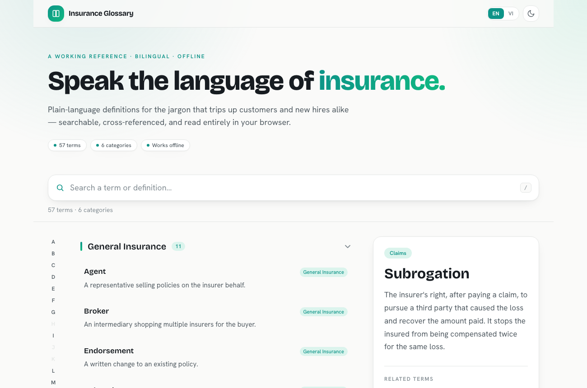
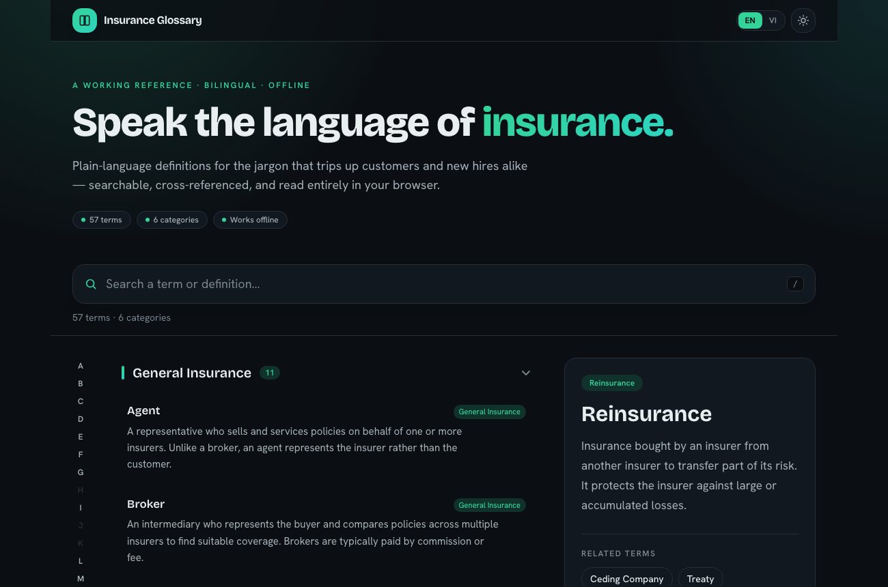

# Insurance Glossary Search

A fast, **bilingual (English / Tiếng Việt)**, offline-capable web app for looking
up insurance terminology. 57 terms across 6 categories, instant search with match
highlighting, related-term navigation, A–Z quick-jump, shareable deep links, and
a light/dark theme — all client-side, no backend.

**Live demo:** _(deployed via GitHub Pages — see [Deployment](#deployment))_




---

## Why this exists

Insurance is dense with jargon that trips up new employees and customers alike.
This app is the shared dictionary: type a few letters, find the term, read a
plain-language definition, and follow the links to adjacent concepts.

Built as a submission for an AI engineering challenge. The brief explicitly
warns against one-shotting it, so this README documents the **decisions and
trade-offs** behind the build, not just how to run it.

## Running locally

```bash
npm install
npm run dev        # http://localhost:5173
npm test           # unit + data-integrity tests (Vitest)
npm run build      # type-check + production build to dist/
npm run preview    # serve the production build
```

Requires Node 18+.

## Features

- **Instant search** across both term names and definitions, with matches
  highlighted (`<mark>`) in-place. Ranking puts name matches above
  definition-only matches, and name-prefix matches above name-mid matches.
- **Category grouping** with expandable sections; searching auto-expands every
  group that has a hit and shows live result counts.
- **Two levels of definition** — the list shows a one-line gloss (enough to
  grasp a term at a glance), while the detail/modal shows the full 2–3 sentence
  definition. Search highlights the matched text in each independently.
- **Term detail** as a sticky side panel on desktop, a bottom-sheet modal on
  mobile. Related terms are clickable chips.
- **Related-term navigation with history** — clicking a related term pushes to
  the browser history, so Back returns to the previous term.
- **A–Z quick-jump rail** with scroll-spy: the active letter highlights as you
  scroll, and empty letters are disabled.
- **Deep links** — the selected term lives in the URL (`?term=deductible`), so
  any term is shareable and the browser Back/Forward buttons work.
- **Keyboard-first**: `/` focuses search, `↑`/`↓` move through results, `Enter`
  opens, `Esc` clears the query or closes the panel. The mobile modal traps
  focus.
- **Bilingual (EN / VI)** — a language toggle translates the UI and all 57
  **definitions** into Vietnamese; the **term names stay in English** (the
  industry terms people actually search). Search is **diacritic-insensitive**, so
  typing `phi` matches `Phí` while highlighting the original accented characters.
- **Light / dark theme** — toggle with the choice persisted; the correct theme is
  applied before first paint (no flash).
- **Accessibility**: `role="search"` with an `aria-live` result count,
  `aria-expanded` on section toggles, `aria-current` on the selected term and
  active letter, focus management, and `prefers-reduced-motion` support.
- **Offline**: all data is bundled into the JS, so after first load there is
  nothing left to fetch.

## Key design decisions

**No backend, no database.** The dataset is ~57 entries — tiny. Bundling it
client-side satisfies the "works offline" requirement for free, removes a whole
deployment surface, and makes the app deployable as static files anywhere. A
server here would be pure overhead.

**No Fuse.js / fuzzy-search library.** With 57 terms, a case-insensitive
substring scan is instant and gives predictable, explainable ranking. Pulling in
a fuzzy-search dependency would add weight and *less* predictable results for
zero practical gain at this scale. The search logic lives in a pure, fully
unit-tested module (`src/utils/search.ts`).

**Search is a pure function.** `filterTerms` / `getMatchRanges` take data in and
return ranked results plus highlight ranges — no React, no DOM. That makes the
core logic trivially testable and keeps components thin. Highlight ranges are
computed once and reused by the `<HighlightedText>` renderer.

**Side panel on desktop, modal on mobile.** On a wide screen you want to keep
the list visible while reading a definition (a panel), but on a phone a
full-width sheet is the natural pattern. Same `<TermDetailPanel>` content,
two wrappers.

**URL as the source of truth for selection.** The selected term is derived from
`?term=`, synced via the History API. This gets deep-linking, sharing, and
Back/Forward navigation almost for free, and dedupes repeated selections so the
history stays clean.

**Accuracy over volume.** The challenge evaluates domain understanding
("learning velocity"), so each of the 57 definitions was written in plain
language and reviewed individually — in both English and Vietnamese. Integrity
tests enforce structural correctness (unique ids, no dead `relatedIds`, every
category populated, ≥40 terms) and that every term has a Vietnamese translation,
so neither the related-term graph nor the bilingual data can silently rot.

**i18n without a library.** With two languages and a small string set, a tiny
React context (`src/i18n`) beats pulling in `i18next`. UI strings live in a typed
dictionary; term names stay English while definitions come from a Vietnamese
override map merged onto the English dataset at load time, so the two never drift
in shape. Search folds Vietnamese
diacritics with a **length-preserving** transform, which keeps highlight offsets
valid against the original accented text.

**Theming via CSS variables.** Light/dark is one set of CSS custom properties
swapped by a `.dark` class on `<html>`. Components reference semantic Tailwind
colors (`bg`, `surface`, `accent`, …) that resolve to those variables, so the
whole UI re-themes with zero `dark:` duplication.

**Where I deliberately stopped (anti-over-engineering).** No state-management
library, no router, no SSR, no i18n framework, no auth, no CRUD/admin. Depth here
comes from edge cases, accessibility, bilingual accuracy, and polish — not from
architecture.

## Project structure

```
src/
├── types.ts                       # GlossaryTerm, Category, order
├── data/
│   ├── glossary-data.ts           # the 57-term dataset (English base)
│   └── glossary-data.test.ts      # integrity tests (no dead links, etc.)
├── i18n/
│   ├── strings.ts                 # typed EN/VI UI string dictionaries
│   ├── i18n-context.tsx           # language provider + useI18n
│   ├── glossary-vi.ts             # Vietnamese name+definition per term id
│   ├── glossary-vi.test.ts        # VI coverage test (all ids translated)
│   ├── use-localized-glossary.ts  # merges EN base + VI override for the lang
│   └── text.ts                    # diacritic fold + A–Z first-letter
├── utils/
│   ├── search.ts                  # pure filter + rank + highlight ranges
│   └── search.test.ts             # ranking, edge cases, diacritic folding
├── hooks/
│   ├── use-url-selection.ts       # selection <-> ?term= via History API
│   ├── use-scroll-spy.ts          # IntersectionObserver -> active letter
│   ├── use-glossary-view.ts       # derived grouped/ranked view
│   └── use-theme.ts               # light/dark + localStorage
├── components/
│   ├── top-bar.tsx                # brand + language + theme toggles
│   ├── search-bar.tsx
│   ├── category-section.tsx       # expandable group
│   ├── term-list-item.tsx
│   ├── highlighted-text.tsx       # wraps matches in <mark>
│   ├── term-detail-panel.tsx      # desktop panel content + placeholder
│   ├── term-detail-modal.tsx      # mobile sheet + focus trap
│   ├── alphabet-sidebar.tsx       # A–Z rail
│   └── empty-state.tsx
└── App.tsx                        # layout + interaction wiring
```

Files are kept small and single-purpose; derived data and side-effects live in
hooks so components stay declarative.

## Tech stack

Vite · React 18 · TypeScript (strict) · Tailwind CSS (CSS-variable theming) ·
Vitest + Testing Library. Type set in **Bricolage Grotesque** (display) and
**Hanken Grotesk** (body). No runtime dependencies beyond React.

## Testing

```bash
npm test   # 28 tests
```

- `search.test.ts` — ranking (name > definition, prefix > mid), case
  insensitivity, match ranges, empty query, special characters, no-match, and
  diacritic-insensitive matching with correct offsets.
- `glossary-data.test.ts` — unique kebab-case ids, every `relatedId` resolves,
  no self-references, every category populated, ≥40 terms, A–Z-reachable names,
  substantive definitions.
- `glossary-vi.test.ts` — every term id has a Vietnamese translation, no extra
  ids, non-empty names and substantive definitions.

## Deployment

A GitHub Actions workflow (`.github/workflows/deploy.yml`) runs the tests,
builds, and publishes `dist/` to GitHub Pages on every push to `main`. The Vite
`base` is relative, so the same build also works at a host root (Vercel,
Netlify) or `file://`.

To enable: push the repo, then in **Settings → Pages** set the source to
**GitHub Actions**.

## Time spent

~4h for the core app: ~1.5h on the English dataset (writing and checking
definitions — the slow part), ~1h on search + list UI, ~1h on detail/navigation,
~0.5h on polish, accessibility, tests, and deployment. A later pass added the
modern redesign (light/dark theming) and the bilingual EN/VI layer (UI strings,
Vietnamese definitions, diacritic-insensitive search).
